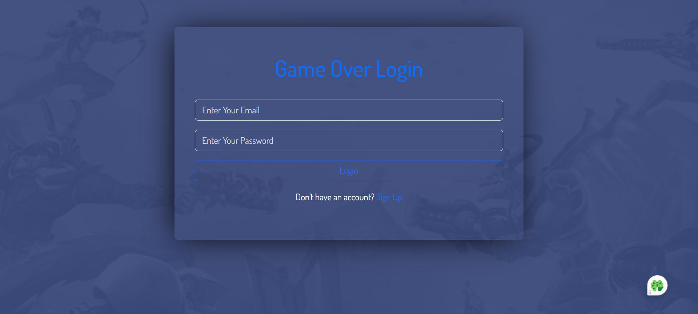
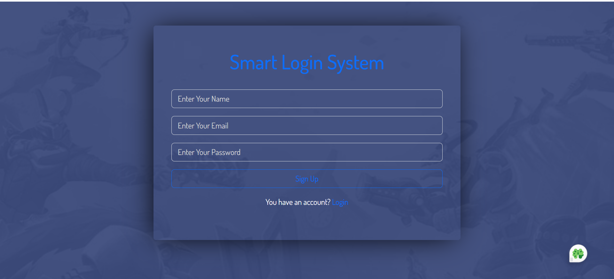
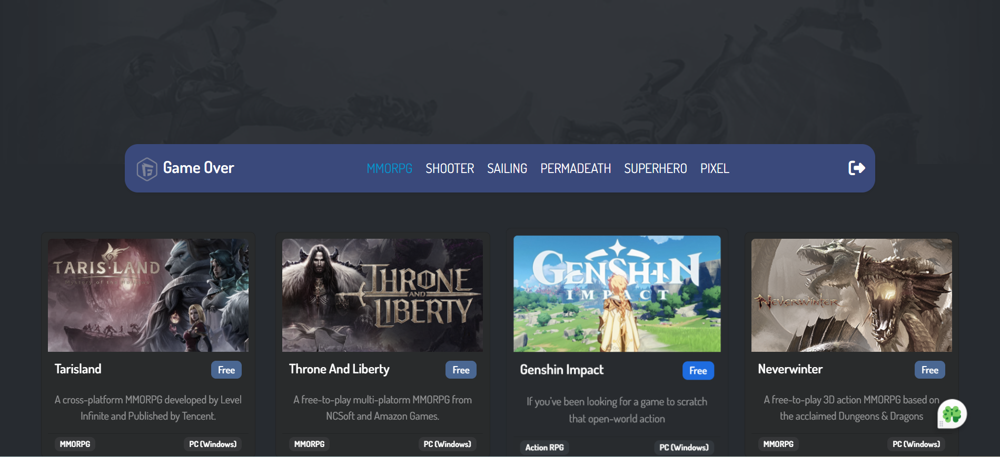
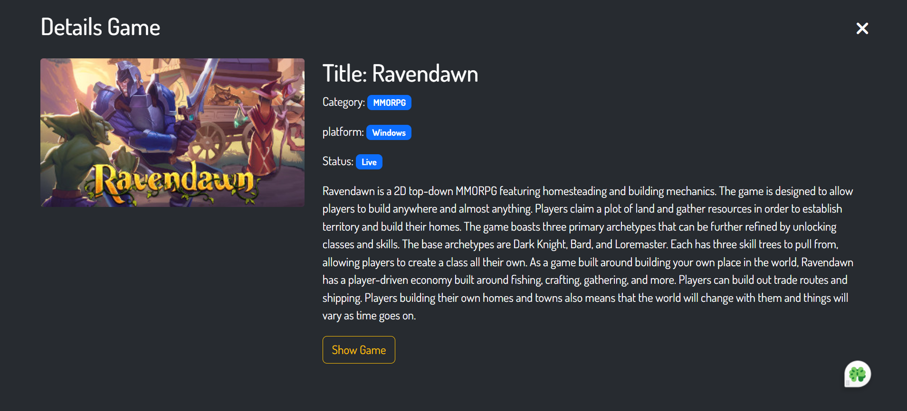

# Game Over Application 🎮

The Game Over App is built using HTML5, CSS3, Bootstrap, JavaScript (ES6), and Object-Oriented Programming (OOP) principles. This project fetches and displays game categories from an API and allows users to view detailed information about each game by clicking on it. Additionally, users must log in to access the website's content, ensuring a personalized and secure experience.

## 🌟 [Live Website](https://game-over-app.netlify.app/) 🌟

---

## Screenshots

---

## Technologies Used

1. **HTML**: Provides the structure of the application.
2. **CSS**: Ensures a modern and responsive design.
3. **Bootstrap**: Adds pre-designed, responsive UI components for faster and easier web development.
4. **JavaScript**: Powers the dynamic and interactive features, including API integration and real-time search.
5. **ES6 and OOP:** Implements modern JavaScript features and object-oriented programming techniques for cleaner and modular code.
6. **API Integration:** Fetches and displays game categories and details. The API used is accessible [Here](https://rapidapi.com/digiwalls/api/free-to-play-games-database)
8. **Netlify**: Used for hosting the live version of the application.

---

## Features

- **Login Requirement:** Ensures secure access to the platform by requiring users to log in before viewing the content.
- **Game Categories**: Displays a variety of game categories fetched dynamically from an API, ensuring up-to-date and relevant content.
- **Detailed Game Information:**: Users can click on a game to view detailed information, including its description, features, and more.
- **Responsive Layout**: Works seamlessly across desktops, tablets, and mobile devices.

---

